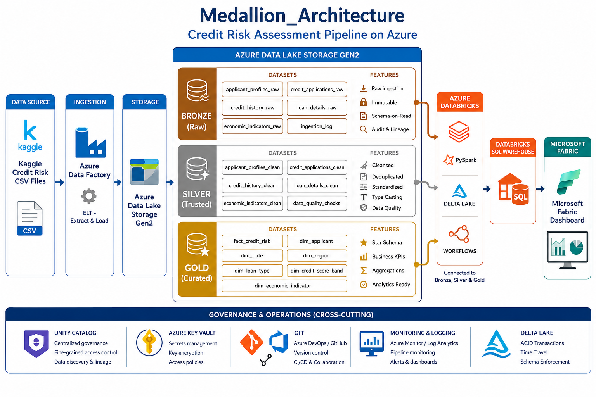
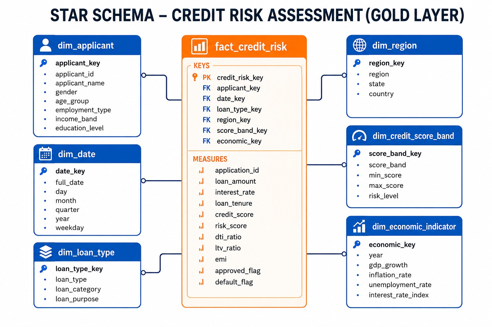
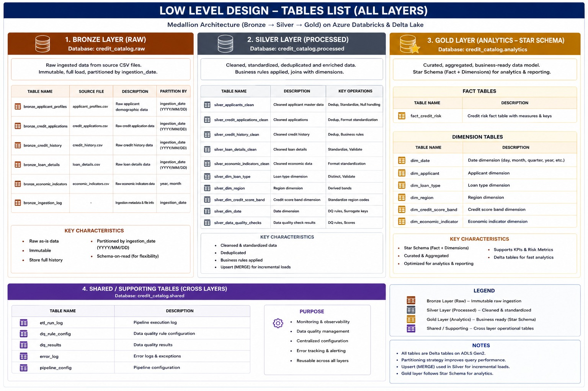

# Credit Risk Assessment Pipeline using Azure Data Factory, Azure Databricks & Microsoft Fabric


---

# Project Overview

This project implements an enterprise-scale Credit Risk Assessment Pipeline using Azure Data Factory, Azure Data Lake Storage Gen2, Azure Databricks, Delta Lake, Unity Catalog, Databricks SQL Warehouse and Microsoft Fabric.

The pipeline follows the Medallion Architecture (Bronze → Silver → Gold) and automates the complete ELT process from raw credit datasets to business-ready dashboards.

---

# Business Problem

Banks receive thousands of loan applications every day.

Manual risk assessment is slow and error-prone.

This solution automates

- Data ingestion
- Data validation
- Data cleansing
- Risk score calculation
- Business analytics
- Dashboard generation

---

# Solution Architecture

```text
Kaggle Dataset

↓

Azure Data Factory

↓

Azure Data Lake Storage Gen2

↓

Azure Databricks

↓

Bronze

↓

Silver

↓

Gold

↓

Databricks SQL Warehouse

↓

Microsoft Fabric Dashboard
```

---

# High Level Architecture

---

<p align="center">
  
</p>

---

# Low Level Design

<p align="center">
  
</p>

---

# Medallion Architecture

<p align="center">

</p>

---

# Star Schema

<p align="center">

</p>

---

# Bronze • Silver • Gold Tables

<p align="center">

</p>

---

# Technology Stack

| Layer | Technology |
|---------|------------|
| Cloud | Microsoft Azure |
| Data Ingestion | Azure Data Factory |
| Storage | Azure Data Lake Storage Gen2 |
| Processing | Azure Databricks |
| Programming | PySpark |
| Storage Format | Delta Lake |
| Governance | Unity Catalog |
| SQL Engine | Databricks SQL Warehouse |
| Dashboard | Microsoft Fabric |
| Reporting | Power BI |
| Version Control | Git |
| Testing | PyTest |

---

# Source Dataset

The project uses the following datasets.

- applicant_profiles.csv
- credit_applications.csv
- credit_history.csv
- loan_details.csv
- economic_indicators.csv

---

# Batch Processing Flow

```text
CSV Files

↓

ADF Pipeline

↓

Convert CSV → Parquet

↓

Azure Data Lake Storage Gen2

↓

Azure Databricks

↓

Bronze Layer

↓

Silver Layer

↓

Gold Layer

↓

Databricks SQL Warehouse

↓

Microsoft Fabric Dashboard
```

---

# Streaming Pipeline

```text
CSV Files

↓

Python Producer

↓

Azure Event Hub

↓

Databricks Structured Streaming

↓

Bronze

↓

Silver

↓

Gold
```

---

# Bronze Layer

Features

- Raw Data Storage
- Immutable Delta Tables
- Watermarking
- Schema Evolution
- Audit Logging
- Error Handling

Tables

- Bronze_Applicant_Profiles
- Bronze_Credit_Applications
- Bronze_Credit_History
- Bronze_Loan_Details
- Bronze_Economic_Indicators
- Bronze_Audit_Log
- Bronze_Error_Log

---

# Silver Layer

Transformations

- Remove Duplicates
- Null Handling
- Standardization
- Data Type Validation
- Business Rules
- SCD Type 2
- Merge
- Delta Optimization
- Time Travel

Tables

- Silver_Applicant
- Silver_Credit
- Silver_Loan
- Silver_Economic
- Silver_Data_Quality

---

# Gold Layer

Dimension Tables

- DIM_APPLICANT
- DIM_DATE
- DIM_REGION
- DIM_LOAN_TYPE
- DIM_CREDIT_SCORE_BAND
- DIM_ECONOMIC_INDICATOR

Fact Table

- FACT_CREDIT_RISK

Business KPIs

- Total Applications
- Loan Approval Rate
- Risk Distribution
- High Risk Customers
- Default Rate
- Average Credit Score
- Average Loan Amount
- Region-wise Analysis
- Debt-To-Income Ratio
- Loan-To-Value Ratio

---

# Data Quality

The pipeline validates

- Duplicate Records
- Null Values
- Schema Validation
- Data Type Validation
- Range Validation
- Business Rule Validation
- Referential Integrity

---

# Delta Lake Features

- ACID Transactions
- Time Travel
- Merge
- Optimize
- Vacuum
- ZORDER
- Schema Evolution
- Delta History

---

# Security & Governance

- Unity Catalog
- RBAC
- Azure Key Vault
- Managed Identity
- Secrets Management
- Audit Logging
- Data Lineage

---

# Monitoring & Logging

- Azure Monitor
- Log Analytics
- Slack Notifications
- Email Alerts
- Pipeline Logs
- Audit Logs

---

# Testing

- Unit Testing
- Integration Testing
- Schema Validation
- Row Count Validation
- Data Quality Validation
- Business Rule Validation

---

# Repository Structure

```text
credit_risk_analysis

│── README.md

│

├── ARCHITECTURE

│ ├── credit_risk_analysis_HLD.png

│ ├── credit_risk_analysis_Low level.png

│ ├── Medallion_Architecture.png

│ ├── STAR_SCHEMA.jpeg

│ └── Tabels_list.jpeg

│

├── datasets

├── notebooks

├── sql

├── dashboards

├── streaming

├── tests

└── docs
```

---

# Future Enhancements

- Real-Time Credit Risk Prediction
- Machine Learning Credit Scoring
- Azure Synapse Analytics
- Azure DevOps CI/CD
- Great Expectations
- Data Observability
- Automated Data Quality Monitoring

---

# Author

## CHAGARLAMUDI KUSUMA SRIYA

Azure Data Engineer

Built an end-to-end Credit Risk Assessment Pipeline using Azure Data Factory, Azure Data Lake Storage Gen2, Azure Databricks, Delta Lake, Unity Catalog, Databricks SQL Warehouse, Microsoft Fabric, and Power BI following the Medallion Architecture.

**GitHub:** https://github.com/kusumasriya
